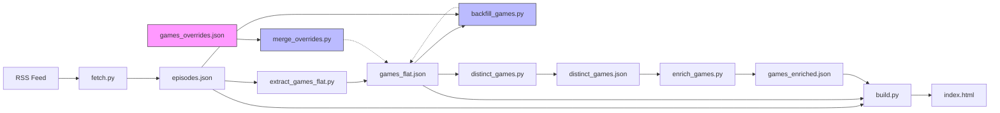
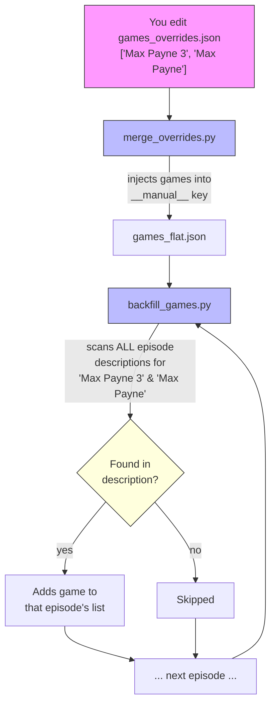

# So Videogames Podcast – Fan Page

Searchable episode listing with game title extraction, Steam enrichment, and poster thumbnails for the [So Videogames Podcast](https://gamecritics.com/category/podcasts/so-videogames/).

**Live at:** [sovideogames-fanpage.normware.org](https://sovideogames-fanpage.normware.org)

## How It Works

The podcast RSS feed is fetched and parsed into structured episode data. Each episode's description is sent through the GitHub Models API (GPT-4o-mini) to extract mentioned game titles. Manually added overrides and a backfill pass catch anything the LLM missed. Finally, game names are deduplicated, enriched with Steam poster URLs, and baked into a single `index.html` with search, dark mode, and episode filtering.

## Data Pipeline

| Step | Script | Input | Output |
|---|---|---|---|
| 1 | `fetch.py` | RSS feed | `episodes.json` |
| 2 | `extract_games_flat.py` | `episodes.json` | `games_flat.json` — per-episode game title arrays via LLM |
| 3 | `merge_overrides.py` | `games_overrides.json` | injected into `games_flat.json` under `__manual__` key, then cleared |
| 4 | `backfill_games.py` | `games_flat.json` + `episodes.json` | scans descriptions for known games the LLM missed |
| 5 | `distinct_games.py` | `games_flat.json` | `distinct_games.json` — alphabetically sorted unique games |
| 6 | `enrich_games.py` | `distinct_games.json` | `games_enriched.json` — poster URLs via Steam API |
| 7 | `build.py` | all above | `index.html` — full site with search, dark mode, posters |



## Usage Scenarios

### 1. Full rebuild

Extract everything from scratch — needed for a first-time setup or when you want to force-reprocess all episodes.

```bash
python3 fetch.py
python3 extract_games_flat.py --force   # re-process ALL episodes via LLM
python3 merge_overrides.py
python3 backfill_games.py
python3 distinct_games.py
python3 enrich_games.py                 # fetches posters for ALL games (~12 min)
python3 build.py
open index.html
```

### 2. Weekly update (new episode dropped)

Only fetches new episodes and processes what's missing. Fast — skips already-extracted episodes and cached posters.

```bash
python3 fetch.py                        # gets new episodes from RSS
python3 extract_games_flat.py           # only processes new/missing episodes
python3 merge_overrides.py
python3 backfill_games.py
python3 distinct_games.py
python3 enrich_games.py                 # only fetches posters for new games
python3 build.py
open index.html
```

### 3. Add a missed game (manual override)

The LLM missed a game? Add it as a flat list in `games_overrides.json`, then run the minimal pipeline. `backfill_games.py` scans all episode descriptions for the name and adds it wherever it appears.

```bash
# First, edit games_overrides.json:
#   ["Max Payne 3", "Max Payne", "Drill Core"]

# Then run:
python3 merge_overrides.py
python3 backfill_games.py
python3 distinct_games.py
python3 enrich_games.py
python3 build.py
open index.html
```

### 4. GitHub Actions (automated)

The repo includes a CI workflow at `.github/workflows/rebuild.yml` that runs scenario 2 automatically every Monday at 10:00 UTC. It commits and pushes any changes — no manual intervention needed.

```mermaid
flowchart LR
    trigger["Schedule: Mon 10:00 UTC\nor workflow_dispatch"] --> checkout["Checkout repo"]
    checkout --> setup["Setup Python"]
    setup --> fetch["python3 fetch.py"]
    fetch --> extract["python3 extract_games_flat.py"]
    extract --> merge["python3 merge_overrides.py"]
    merge --> backfill["python3 backfill_games.py"]
    backfill --> distinct["python3 distinct_games.py"]
    distinct --> enrich["python3 enrich_games.py"]
    enrich --> build["python3 build.py"]
    build --> git["git add, commit & push"]

    style trigger fill:#ffd,stroke:#333
    style git fill:#dfd,stroke:#333
```



## Features

- **Search** — live filter across episode titles and descriptions
- **Dark/light mode** — persisted to localStorage
- **Episode number filter** — jump to a specific episode
- **Game list** — per-episode bullet list of mentioned games
- **Steam links** — known games link directly to their Steam store page
- **Poster thumbnails** — Steam capsule images in a 2-column grid (togglable, hidden by default)
- **Manual overrides** — add games the LLM missed via `games_overrides.json`

## Adding Missed Games

If the LLM didn't detect a game, add it to `games_overrides.json` as a flat list:

```json
["Max Payne 3", "Max Payne", "Drill Core"]
```

Then run the minimal pipeline (scenario 3 above). Here's what happens step by step:



> **Why a flat list?** Since `backfill_games.py` scans episode descriptions for known game names, you don't need to specify which episode a game belongs to — just adding the name is enough. Backfill handles the rest.

### Backfill caveat

The override game **must appear in an episode's description text** for backfill to find it. If the name isn't mentioned in the description, backfill can't detect it. In that case, manually add it to the specific episode's entry in `games_flat.json`:

```json
{
  "487": ["Max Payne 3", "Max Payne"],
  "486": ["Drill Core"]
}
```

This old format can be placed directly in `games_flat.json` (not `games_overrides.json`) for one-off fixes.

## Notes

- **366 / 486** episodes in feed (pre-2019 not in RSS)
- Game extraction uses **GitHub Models API** (free) via `GITHUB_TOKEN`
- Poster enrichment uses **Steam Store API** (free, no key needed)
- Set `RAWG_API_KEY` env var for better poster coverage (free at rawg.io/apidocs)
- Game artwork © respective publishers
